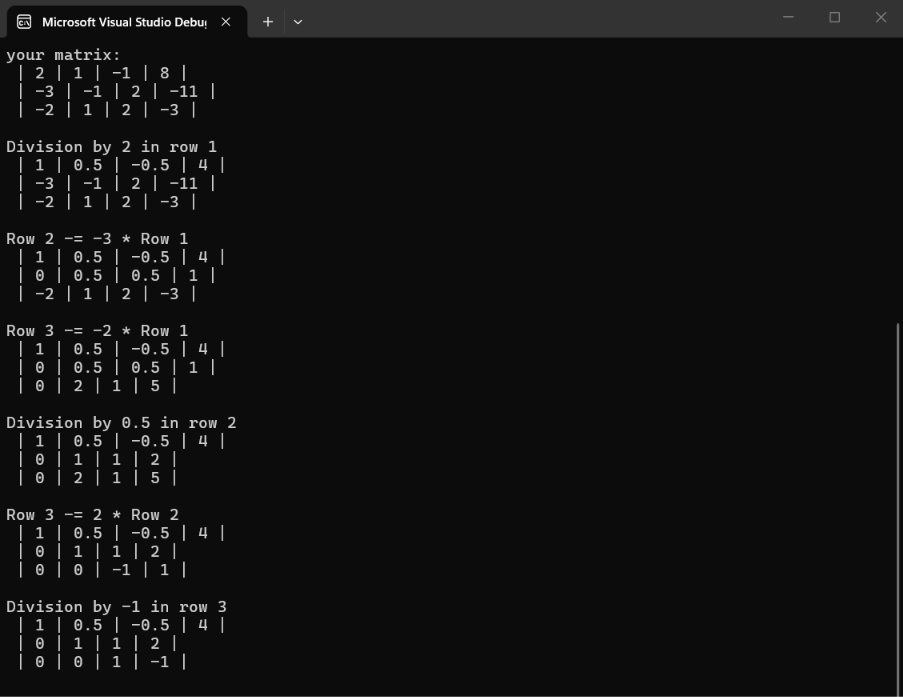
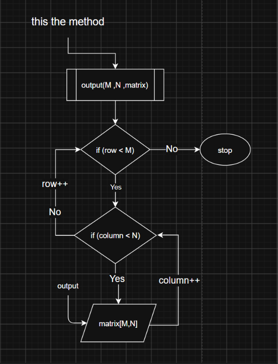
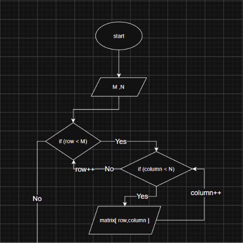
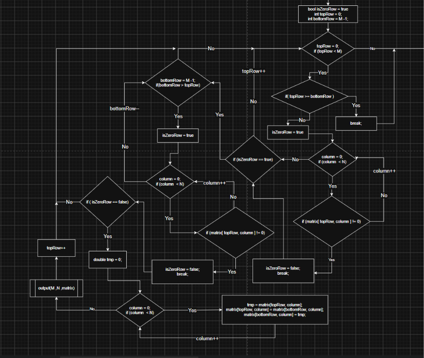
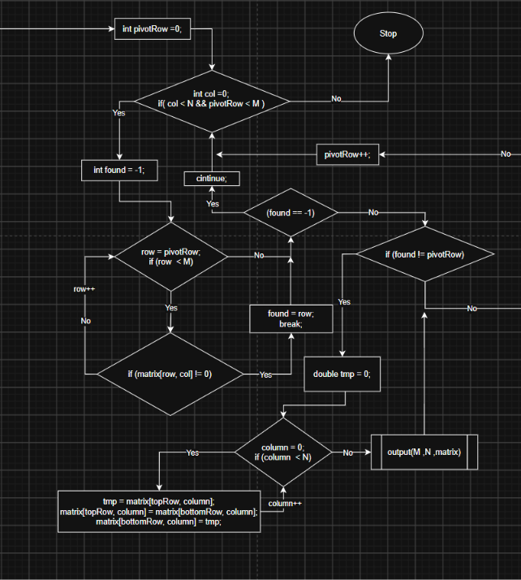
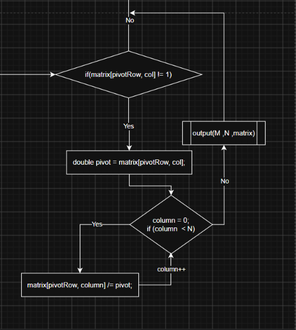
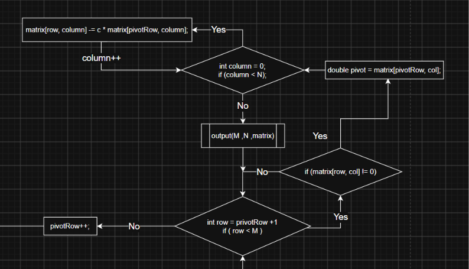

# Linear System Solver

A C# console application that reduces a matrix to row-echelon form using elementary row operations. The matrix is usually the augmented matrix of a linear system, and the matrix is printed after every operation so the reduction can be followed step by step.

I built it to practice turning an algorithm into a flowchart and then into code. The flowchart is included in the repository next to the source.

**Scope:** the program stops at row-echelon form. It does not yet read off the values of the unknowns or classify the system as having a unique solution, infinitely many solutions, or none. See [Limitations](#limitations).

---

## How it works

The program works through the matrix one column at a time, from left to right, keeping track of the current pivot row:

1. Find the first non-zero entry in the column, at or below the pivot row. If there is none, skip the column.
2. If that entry is in a different row, swap it into the pivot row.
3. Divide the pivot row by the pivot so the pivot becomes `1`.
4. Subtract multiples of the pivot row from the rows below it so the rest of the column becomes `0`.
5. Move the pivot row down by one.

Before this loop starts, any rows that are entirely zero are moved to the bottom.

The full editable flowchart is in [`docs/Linear-System-Solver-Flowchart.drawio`](docs/Linear-System-Solver-Flowchart.drawio) and can be opened with [diagrams.net](https://app.diagrams.net).

---

## Example

Input (an augmented matrix):

```text
[  2   1  -1    8 ]
[ -3  -1   2  -11 ]
[ -2   1   2   -3 ]
```

Operations performed:

```text
R1 ← R1 / 2
R2 ← R2 + 3·R1
R3 ← R3 + 2·R1
R2 ← R2 / 0.5
R3 ← R3 − 2·R2
R3 ← R3 / (−1)
```

Result:

```text
[ 1   0.5  -0.5   4 ]
[ 0   1     1     2 ]
[ 0   0     1    -1 ]
```

Back-substitution on this result gives `x = 2`, `y = 3`, `z = -1`. The program does not perform that last step yet.



---

## Implementation notes

Each part below matches a section of the flowchart and a snapshot in `docs/images/`.

### Printing the matrix

`output(M, N, matrix)` prints the matrix without modifying it. It is called after every swap, normalization and elimination, which keeps the printing logic out of the main algorithm.

```csharp
static void output(int M, int N, Double[,] matrix)
{
    for (int i = 0; i < M; i++)
    {
        for (int j = 0; j < N; j++)
            Console.Write(" | " + matrix[i, j]);
        Console.WriteLine(" |");
    }
    Console.WriteLine();
}
```



### Matrix input

The user enters the number of rows `M` and columns `N`, then each element in row-major order. The original matrix is printed once before anything changes.

```csharp
Console.Write("Enter size row: ");
M = int.Parse(Console.ReadLine()!);
Console.Write("Enter size column: ");
N = int.Parse(Console.ReadLine()!);

Double[,] matrix = new double[M, N];

for (int row = 0; row < M; row++)
    for (int column = 0; column < N; column++)
    {
        Console.WriteLine($"Enter your number ({row + 1},{column + 1})");
        matrix[row, column] = double.Parse(Console.ReadLine()!);
    }
```



### Zero-row handling

A row of all zeros can never provide a pivot, so it is moved to the bottom. `topRow` walks down from the first row and `bottomRow` walks up from the last. When `topRow` is a zero row, it is swapped with the nearest non-zero row found from the bottom.

```csharp
bool isZeroRow = true;
for (int column = 0; column < N; column++)
{
    if (matrix[topRow, column] != 0)
    {
        isZeroRow = false;
        break;   // one non-zero entry is enough
    }
}
```

```text
[ 2  1  5 ]        [ 2  1  5 ]
[ 0  0  0 ]   →    [ 3  4  1 ]
[ 3  4  1 ]        [ 0  0  0 ]
```



### Pivot search and row swapping

`pivotRow` marks the row that should hold the next pivot. For each column the program looks for a non-zero entry from `pivotRow` downward. `found` stays at `-1` if there is none, and the column is skipped with `continue`.

```csharp
int found = -1;
for (int row = pivotRow; row < M; row++)
{
    if (matrix[row, col] != 0)
    {
        found = row;
        break;
    }
}
if (found == -1) continue;
```

If the entry is in another row, the two rows are swapped completely. Swapping a single cell would mix up the equations.

```csharp
if (found != pivotRow)
{
    for (int column = 0; column < N; column++)
    {
        double tmp = matrix[pivotRow, column];
        matrix[pivotRow, column] = matrix[found, column];
        matrix[found, column] = tmp;
    }
}
```



### Pivot normalization

If the pivot is not already `1`, the whole row is divided by it. The pivot is stored first, because the cell itself changes during the loop.

```csharp
if (matrix[pivotRow, col] != 1)
{
    double pivot = matrix[pivotRow, col];
    for (int column = 0; column < N; column++)
        matrix[pivotRow, column] /= pivot;
}
```

```text
[ 2  6  4 | 10 ]   →   [ 1  3  2 | 5 ]
```



### Row elimination

Every row below the pivot with a non-zero entry in the pivot column has a multiple of the pivot row subtracted from it. The multiplier `c` is saved before the loop, for the same reason as above.

```csharp
for (int row = pivotRow + 1; row < M; row++)
{
    if (matrix[row, col] != 0)
    {
        double c = matrix[row, col];
        for (int column = 0; column < N; column++)
            matrix[row, column] -= c * matrix[pivotRow, column];
    }
}
```

```text
Pivot row:   [ 1   2   3 |   4 ]
Target row:  [ 5   7   9 |  10 ]      R2 ← R2 − 5·R1
Result:      [ 0  -3  -6 | -10 ]
```



---

## Edge cases

| Situation | What the program does |
|---|---|
| A row is entirely zero | Swaps it with the nearest non-zero row from the bottom |
| The column has no non-zero entry at or below the pivot row | Skips the column, the pivot row does not advance |
| The pivot is in a lower row | Swaps the two full rows |
| The pivot is already `1` | Skips the division |
| An entry below the pivot is already `0` | Leaves that row unchanged |

Skipping a column matters. For the matrix below, column 2 has no pivot, so the program moves on to column 3 and uses the same pivot row there:

```text
[ 1  2  3 ]
[ 0  0  4 ]
[ 0  0  5 ]
```

---

## Complexity

For a square `n × n` matrix, the reduction takes `O(n³)` time and `O(n²)` memory. In practice the repeated console output is the slowest part. It is useful for following the steps, but it should be reduced or removed if performance matters.

---

## Running the project

Requires the [.NET SDK](https://dotnet.microsoft.com/download).

```bash
git clone https://github.com/mohamed-farouk0/Linear-System-Solver.git
cd Linear-System-Solver/src/Linear-System-Solver
dotnet run
```

Or open the `.csproj` in Visual Studio and press Run. Enter the dimensions, then each value, and the program prints the matrix after every operation.

---

## Project structure

```text
Linear-System-Solver/
├── src/
│   └── Linear-System-Solver/
│       ├── Linear-System-Solver.csproj
│       └── Program.cs
├── docs/
│   ├── Linear-System-Solver-Flowchart.drawio
│   └── images/            section snapshots (01–07)
├── LICENSE
└── README.md
```

---

## Limitations

- Stops at row-echelon form, with no back-substitution or full Gauss-Jordan reduction.
- Does not classify the system (unique, infinite, or no solution).
- No input validation. Non-numeric input throws an exception.
- Compares floating-point values directly with `0` and `1`, so tiny rounding errors can be treated as non-zero.

Planned next steps, in order:

1. Back-substitution to extract the solution.
2. System classification.
3. An epsilon comparison instead of `!= 0`.
4. Moving swap, normalize, eliminate and print into separate methods.
5. Input validation.

---

## Author

**Mohamed Farouk**, Software Engineering student at the Faculty of Computers and Information, Mansoura University.

GitHub: [mohamed-farouk0](https://github.com/mohamed-farouk0)
